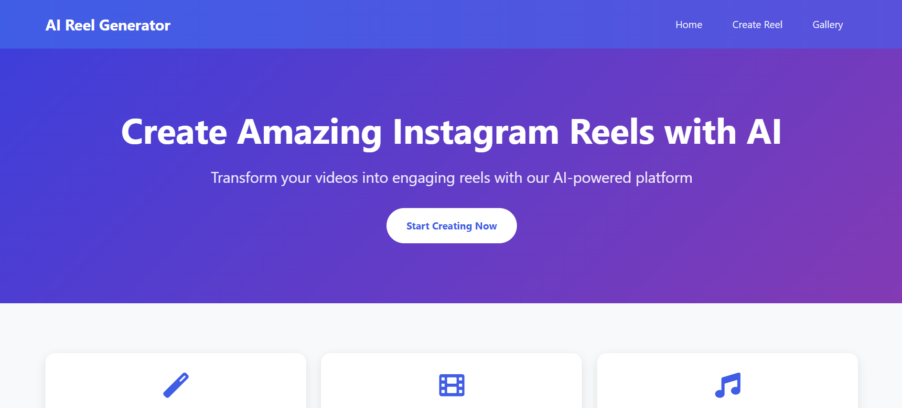

# 🎬 VidSnap AI – AI-Powered Instagram Reel Generator

 <!-- Replace with the actual path to your image in the repo -->

**VidSnap AI** is a Flask-based web application that transforms your text into engaging Instagram reels using **Eleven Labs** for voice synthesis and **FFmpeg** for audio-video processing. It’s a fast, simple, and AI-powered way to generate professional-sounding reels from text!

---

## 🚀 Features

- 🎙️ Convert any text into human-like voiceovers using Eleven Labs API  
- 🎞️ Combine audio with visuals to generate complete video reels using FFmpeg  
- 🌐 Clean and responsive frontend using pure HTML & CSS  
- ⚙️ Lightweight backend built with Python Flask  
- 🖱️ Simple interface to quickly generate reels from your text input

---

## 🛠️ Tech Stack

| Layer        | Technology                      |
|--------------|----------------------------------|
| **Frontend** | HTML, CSS                        |
| **Backend**  | Python, Flask                    |
| **AI Voice** | Eleven Labs Text-to-Speech API   |
| **Media**    | FFmpeg (for video/audio merging) |

---

## ⚙️ Installation Guide


### 1. Clone the repository

```bash
git clone https://github.com/VarenyaVisen/VidSnap-Ai.git
cd VidSnap-Ai
```
### 2. Create a virtual environment
```bash
python -m venv venv
source venv/bin/activate     # On Windows: venv\Scripts\activate
```
### 3. Install dependencies
```bash
pip install -r requirements.txt
```
### 4. Set up your Eleven Labs API key
Create a .env file in the root directory and add the following:
```env
ELEVEN_LABS_API_KEY=your_api_key_here
```
### 5. Ensure FFmpeg is installed
Check FFmpeg installation:
```bash
ffmpeg -version
```
If not installed, download it from https://ffmpeg.org/download.html and add it to your system’s PATH
### 6. Run the Flask app
```bash
flask run
```
Visit http://127.0.0.1:5000 in your browser


